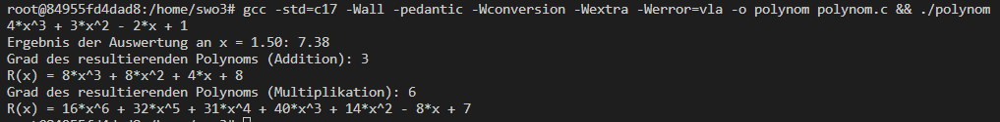

# **SWO3-Übungen - WS2023/24 - Übungszettel 2 - Ausarbeitung**

## **Beispiel 1**

### **Lösungsidee**

Teil a: Die Funktion durchläuft das Array p[] von Index 0 bis m und prüft für jeden Koeffizienten, ob er ungleich null ist. Wenn der Koeffizient nicht null ist, wird der entsprechende Term des Polynoms erstellt und ausgegeben.
Es wird eine Variable "firstTerm" verwendet um den ersten Ausdruck zu kennzeichnen und das korrekte Vorzeichen zu setzen. 
Wenn firstTerm den Wert 1 hat (was zu Beginn der Fall ist), wird das Vorzeichen des ersten Ausdrucks nicht ausgegeben. Nach dem ersten Ausdruck wird firstTerm auf 0 gesetzt, um sicherzustellen, dass für alle nachfolgenden Ausdrücke das Vorzeichen korrekt gesetzt wird.

Teil b:
Die Funktion verwendet das Horner Shema verwendet, um das Polynom effizient zu evaluieren. Dabei beginnt man mit dem höchsten Grad des Polynoms, multipliziert das bisherige Ergebnis mit x und addiert den nächsten Koeffizienten. Dies wird solange wiederholt, bis alle Koeffizienten verarbeitet wurden. 

Teil c:
Der Code addiert zwei Polynome p und q und speichert das Ergebnis im Array r. Dabei werden die Koeffizienten der Polynome auf gleiche Exponenten ausgerichtet und dann addiert. Die Funktion gibt den Grad des resultierenden Polynoms zurück.

Teil d: 
Der Code multipliziert zwei Polynome p und q und speichert das Ergebnis im Array r. Zuerst wird Speicher für das Ergebnispolynom allokiert und auf Nullen initialisiert. Dann werden die Koeffizienten der Polynome miteinander multipliziert und im Ergebnis gespeichert. Schließlich wird der allokierte Speicher freigegeben, und der Grad des resultierenden Polynoms wird zurückgegeben.

Teil e:
nicht implementiert

### **Testfälle**

